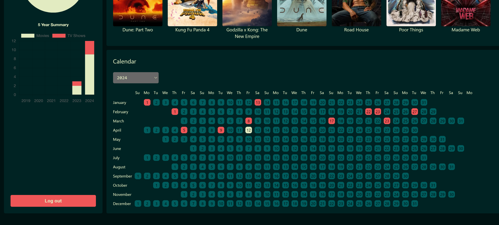

# movies-wrapped

_Web App Last update 18/04/2024_




A non-commercial app that allows users to keep track of movies and shows they watched. Users can generate yearly and monthly summaries.

## Current Features:
* User log in and log out
* View trending movies and tv shows
* Add/save movies or tv shows to user watchlist
* View user watchlist page
* View yearly calendar summary of days movie/show was watched
* View graph and data summaries of movies/shows watched
* Update existing watchlist entries
* Delete existing watchlist entries
* Search database for movies/shows
* Manual watchlist entry

## Features To Be Added:
* Generate yearly and monthly watchlist summaries and share them with friends and other users

## This web app uses:
* React
* Express.js
* Typescript
* HTML
* Tailwind CSS
* MongoDB
* Postman
* Formik
* Yup
* Redux
* react-chartjs-2
* Axios

## Credits


This product uses the TMDB API but is not endorsed or certified by TMDB.

## Dependencies:
Install package.json for frontend and backend
```
npm install
```

## Getting Started:
Set up config files for both the frontend and backend for development, testing, and production.
To start in development mode:
```
npm run dev
```